# 🔄 Flux de Communication - Hedera Health ID

## 📋 Vue d'ensemble

Ce document détaille les flux de communication entre les différentes couches de l'application Hedera Health ID, depuis l'interface utilisateur jusqu'à la base de données, en passant par les APIs et les services.

## 🌐 Architecture de Communication

```
┌─────────────┐    HTTP/HTTPS    ┌─────────────┐    SQL/TCP    ┌─────────────┐
│  Frontend   │◄────────────────►│   Backend   │◄─────────────►│  Database   │
│  React App  │     REST API     │  Express    │   Prisma ORM  │ PostgreSQL  │
└─────────────┘                  └─────────────┘               └─────────────┘
       │                                │                              │
       │ WebSocket (Future)             │ Blockchain RPC               │
       │                                │                              │
       ▼                                ▼                              ▼
┌─────────────┐                  ┌─────────────┐               ┌─────────────┐
│ Service     │                  │   Hedera    │               │   Cache     │
│ Worker      │                  │  Hashgraph  │               │   Redis     │
│ (PWA)       │                  │   Network   │               │  (Future)   │
└─────────────┘                  └─────────────┘               └─────────────┘
```

## 🔐 Flux d'Authentification

### 1. Authentification Patient

```mermaid
sequenceDiagram
    participant U as User (Patient)
    participant F as Frontend
    participant A as API Backend
    participant D as Database
    
    U->>F: Saisit ID + Password
    F->>F: Validation côté client
    F->>A: POST /api/v1/auth/patient
    A->>A: Validation des données
    A->>D: SELECT patient WHERE patientId = ?
    D->>A: Données patient + passwordHash
    A->>A: bcrypt.compare(password, hash)
    A->>D: UPDATE lastLogin
    A->>F: { success: true, data: { token, patient } }
    F->>F: localStorage.setItem('patient_session')
    F->>U: Redirection vers dashboard
```



### 2. Authentification Médecin

```mermaid
sequenceDiagram
    participant M as Médecin
    participant F as Frontend
    participant A as API Backend
    participant D as Database
    
    M->>F: Email + Password + Hôpital
    F->>A: POST /api/v1/auth/medecin
    A->>D: SELECT medecin JOIN hopital
    D->>A: Données médecin + hôpital
    A->>A: Validation password + hôpital
    A->>D: UPDATE lastLogin
    A->>F: { success: true, data: { token, medecin } }
    F->>F: storeMedecinData()
    F->>M: Dashboard médecin
```



### 3. Authentification Hôpital

```mermaid
sequenceDiagram
    participant H as Admin Hôpital
    participant F as Frontend
    participant A as API Backend
    participant D as Database
    
    H->>F: AdminID + Password
    F->>A: POST /api/v1/auth/hospital
    A->>D: SELECT hospital_admin JOIN hopital
    D->>A: Données admin + hôpital
    A->>A: bcrypt.compare(password, hash)
    A->>D: UPDATE lastLogin
    A->>F: { success: true, data: { token, admin } }
    F->>F: localStorage.setItem('hospital_session')
    F->>H: Dashboard hôpital
```



## 📊 Flux de Données Métier

### 1. Consultation Patient - Historique


### 2. Création Consultation (Médecin)


### 3. Gestion Patients (Hôpital)

```mermaid
sequenceDiagram
    participant H as Admin Hôpital
    participant F as Frontend
    participant A as API Backend
    participant D as Database
    
    H->>F: Dashboard hôpital
    F->>A: GET /api/v1/patients?hopital={code}
    A->>D: SELECT patients WHERE hopitalPrincipal = ?
    D->>A: Liste patients de l'hôpital
    A->>F: { success: true, data: patients[], count }
    
    F->>A: GET /api/v1/medecins?hopital={code}
    A->>D: SELECT medecins WHERE hopitalId = ?
    D->>A: Liste médecins de l'hôpital
    A->>F: { success: true, data: medecins[], count }
    
    F->>H: Dashboard avec statistiques
```



## 🔧 Gestion des Erreurs

### 1. Flux d'Erreur Standard


### 2. Types d'Erreurs Gérées

```typescript
// Erreurs d'authentification
{
  "success": false,
  "error": "Identifiants invalides",
  "code": "AUTH_INVALID_CREDENTIALS"
}

// Erreurs de validation
{
  "success": false,
  "error": "Données invalides",
  "details": {
    "patientId": "Format invalide",
    "password": "Trop court"
  }
}

// Erreurs serveur
{
  "success": false,
  "error": "Erreur serveur interne",
  "code": "INTERNAL_SERVER_ERROR"
}

// Erreurs de ressource
{
  "success": false,
  "error": "Patient non trouvé",
  "code": "RESOURCE_NOT_FOUND"
}
```

## 📡 Protocoles de Communication

### 1. HTTP/HTTPS REST API

```typescript
// Configuration client API
class ApiService {
  private baseUrl = 'http://localhost:3001';
  
  async request<T>(endpoint: string, options: RequestInit = {}): Promise<ApiResponse<T>> {
    const url = `${this.baseUrl}${endpoint}`;
    
    const response = await fetch(url, {
      headers: {
        'Content-Type': 'application/json',
        'Accept': 'application/json',
        ...options.headers,
      },
      mode: 'cors',
      credentials: 'omit',
      ...options,
    });
    
    if (!response.ok) {
      throw new Error(`HTTP ${response.status}: ${response.statusText}`);
    }
    
    const data = await response.json();
    
    // Extraction directe si structure backend
    if (data.success !== undefined) {
      return data;
    }
    
    return { success: true, data };
  }
}
```

### 2. WebSocket (Future - Temps Réel)

```typescript
// Service WebSocket pour notifications temps réel
class WebSocketService {
  private ws: WebSocket;
  
  connect(token: string) {
    this.ws = new WebSocket(`ws://localhost:3001/ws?token=${token}`);
    
    this.ws.onmessage = (event) => {
      const message = JSON.parse(event.data);
      this.handleMessage(message);
    };
  }
  
  private handleMessage(message: any) {
    switch (message.type) {
      case 'NEW_CONSULTATION':
        this.notifyNewConsultation(message.data);
        break;
      case 'PATIENT_UPDATE':
        this.notifyPatientUpdate(message.data);
        break;
    }
  }
}
```

## 🔄 Flux de Données Temps Réel

### 1. Notifications Push (Future)

```mermaid
sequenceDiagram
    participant M as Médecin A
    participant A as API Backend
    participant W as WebSocket Server
    participant P as Patient
    participant D as Médecin B
    
    M->>A: Nouvelle consultation patient
    A->>A: Traitement consultation
    A->>W: Notification consultation
    W->>P: Push notification patient
    W->>D: Notification médecin traitant
    P->>P: Affichage notification
    D->>D: Affichage notification
```



### 2. Synchronisation Données

```typescript
// Service de synchronisation
class SyncService {
  private lastSync: Date;
  
  async syncPatientData(patientId: string): Promise<void> {
    const response = await api.getPatientById(patientId);
    
    if (response.success) {
      // Mise à jour cache local
      await this.updateLocalCache(patientId, response.data);
      
      // Notification UI
      this.notifyDataUpdate(patientId);
    }
  }
  
  async syncConsultations(patientId: string): Promise<void> {
    const lastSync = this.getLastSyncTime(patientId);
    const response = await api.getPatientConsultations(patientId, { since: lastSync });
    
    if (response.success && response.data.length > 0) {
      await this.mergeConsultations(patientId, response.data);
      this.setLastSyncTime(patientId, new Date());
    }
  }
}
```

## 🔐 Sécurisation des Communications

### 1. Chiffrement des Données

```typescript
// Chiffrement côté client (Future)
class EncryptionService {
  private key: CryptoKey;
  
  async encryptSensitiveData(data: any): Promise<string> {
    const jsonData = JSON.stringify(data);
    const encodedData = new TextEncoder().encode(jsonData);
    
    const encryptedData = await crypto.subtle.encrypt(
      { name: 'AES-GCM', iv: crypto.getRandomValues(new Uint8Array(12)) },
      this.key,
      encodedData
    );
    
    return btoa(String.fromCharCode(...new Uint8Array(encryptedData)));
  }
}
```

### 2. Validation et Sanitisation

```typescript
// Middleware de validation
const validatePatientData = (req: Request, res: Response, next: NextFunction) => {
  const { patientId, nom, prenom, email } = req.body;
  
  // Validation format
  if (!patientId || !/^BJ\d{7}$/.test(patientId)) {
    return res.status(400).json({
      success: false,
      error: 'Format ID patient invalide'
    });
  }
  
  // Sanitisation
  req.body.nom = sanitizeString(nom);
  req.body.prenom = sanitizeString(prenom);
  req.body.email = sanitizeEmail(email);
  
  next();
};
```

## 📊 Monitoring des Communications

### 1. Métriques de Performance

```typescript
// Middleware de monitoring
const monitoringMiddleware = (req: Request, res: Response, next: NextFunction) => {
  const startTime = Date.now();
  
  res.on('finish', () => {
    const duration = Date.now() - startTime;
    
    // Log des métriques
    logger.info('API Request', {
      method: req.method,
      url: req.url,
      statusCode: res.statusCode,
      duration,
      userAgent: req.get('User-Agent'),
      ip: req.ip
    });
    
    // Métriques Prometheus (Future)
    httpRequestDuration.observe(
      { method: req.method, route: req.route?.path, status_code: res.statusCode },
      duration / 1000
    );
  });
  
  next();
};
```

### 2. Health Checks

```typescript
// Endpoint de santé détaillé
app.get('/health', async (req, res) => {
  const health = {
    status: 'OK',
    timestamp: new Date().toISOString(),
    services: {
      database: await checkDatabaseHealth(),
      redis: await checkRedisHealth(), // Future
      hedera: await checkHederaHealth(), // Future
    },
    metrics: {
      uptime: process.uptime(),
      memory: process.memoryUsage(),
      cpu: process.cpuUsage()
    }
  };
  
  const isHealthy = Object.values(health.services).every(service => service.status === 'OK');
  
  res.status(isHealthy ? 200 : 503).json(health);
});
```

## 🚀 Optimisations de Performance

### 1. Cache et Mise en Cache

```typescript
// Service de cache (Future)
class CacheService {
  private cache = new Map<string, { data: any, expiry: Date }>();
  
  async get<T>(key: string): Promise<T | null> {
    const cached = this.cache.get(key);
    
    if (cached && cached.expiry > new Date()) {
      return cached.data;
    }
    
    this.cache.delete(key);
    return null;
  }
  
  async set<T>(key: string, data: T, ttlSeconds: number = 300): Promise<void> {
    const expiry = new Date(Date.now() + ttlSeconds * 1000);
    this.cache.set(key, { data, expiry });
  }
}
```

### 2. Pagination et Filtrage

```typescript
// Pagination optimisée
app.get('/api/v1/patients', async (req, res) => {
  const page = parseInt(req.query.page as string) || 1;
  const limit = Math.min(parseInt(req.query.limit as string) || 10, 100);
  const offset = (page - 1) * limit;
  
  const [patients, total] = await Promise.all([
    prisma.patient.findMany({
      skip: offset,
      take: limit,
      orderBy: { createdAt: 'desc' }
    }),
    prisma.patient.count()
  ]);
  
  res.json({
    success: true,
    data: patients,
    pagination: {
      page,
      limit,
      total,
      pages: Math.ceil(total / limit)
    }
  });
});
```

---

**🔄 Communication fluide et sécurisée pour un écosystème de santé moderne**
